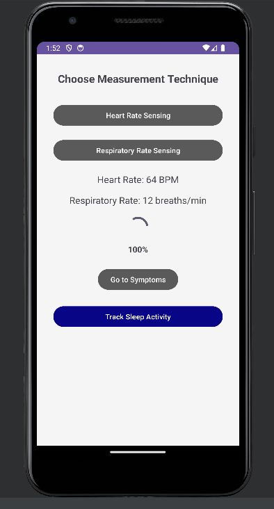
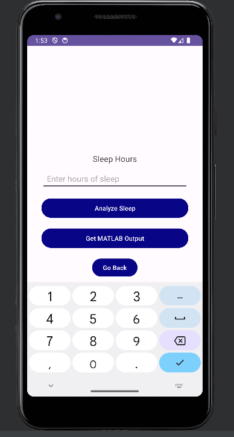
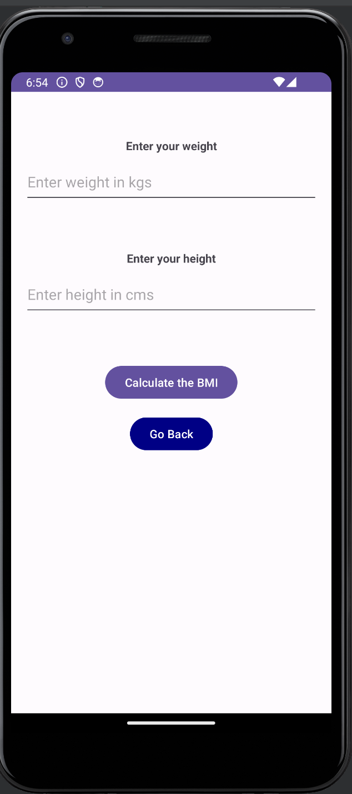
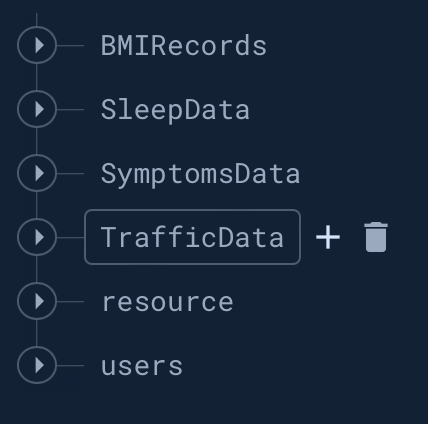
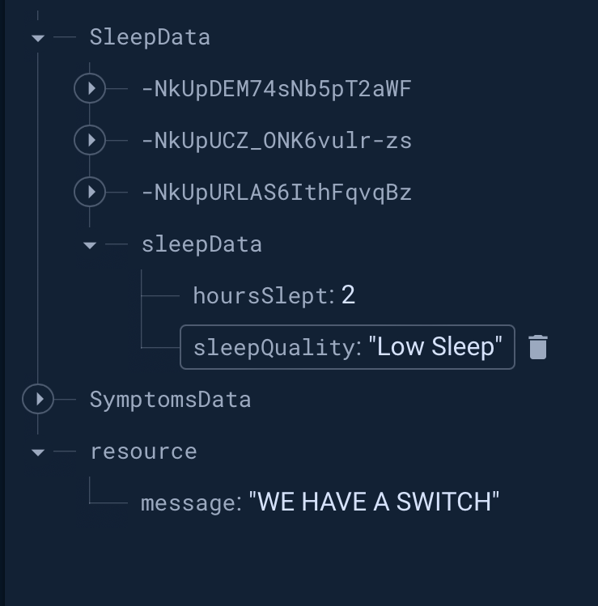
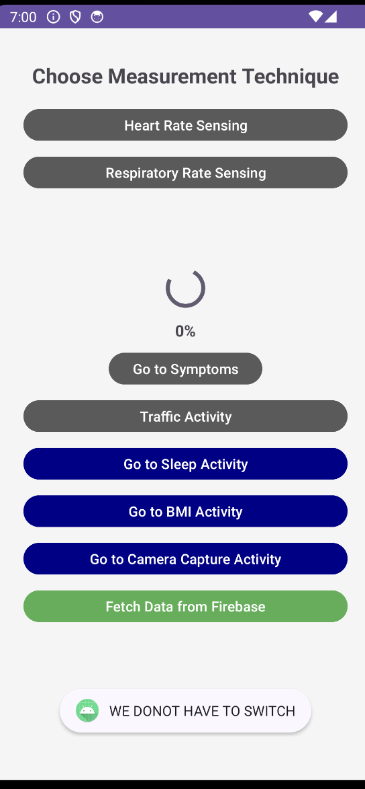

# The project is divided in 3 tasks - 1. Android 2. Intoxication Calculation with Python 3. Fuzzy analysis with matlab

## Task 1

# Enhancing Autonomous Vehicle Safety through Real-time User Health Monitoring and Various factors integration.

This project includes addition of BMI analysis and sleep analysis, Video activity for Task 2 and creating real-time connection between android and matlab using Google Firebase with NoSQL database.

## Introduction

Instructions to run the work done by Shubham Indulkar & Deekshith Reddy Yeruva as part of Task 1.

## Prerequisites


- Android Studio Emulator/ Android device
- MATLAB

### Installing

1. Clone the branch `main` to your local machine
2. To test the android application, you can Open the CM folder in Android Studio or either use the provided .apk file `app-debug.apk` to install the application on your Android device.

## Using the Application

1. Launch the application on your device/emulator.
2. To track sleep activity, click on the blue "Go to Sleep Activity" or "Go to BMI Activity" button.
   
3. If you click on the sleep activity button, enter the sleep in hours and click analyze sleep button
   
4. If you click on the BMI activity button, enter the weight and height and see the BMI output on toast.
   
5. We have also added activity to take video input in android app which will be sent to input to Task 2 through firebase
6. After this, you will get a toast message with the respected BMI analysis/ Sleep Quality (low, average or high) and the data will be uploaded to google firebase.


## MATLAB Script

1. Open the `real_time_connection.m` script given in MATLAB IDE.
2. Run this script and you will get BMI output, avergae speed, herat rate, respiratory rate, and total sleep hours and quality as output

## Firebase Database Snapshot

Please refer at the resource json to see the switch output on firebase.


## Notifications

- Upon detecting the switch output and sending the data from matlab through firebase, it will be displayed as toast in android application.




## Task 2

# Enhancing Autonomous Vehicle Safety through Real-time User Health Monitoring and Various factors integration.

This includes caluclating intoxication level of driver using face detection.

## Introduction

Instructions to run the work done by Sai Likhith Yadav Seera & Lavanya Reddy Duddhugunta as part of Task 2.

Task 2 involves precisely identifying user intoxication levels. This task encompasses advanced video data analysis, machine learning techniques, and facial recognition. Preprocessing techniques like clustering, encoding, segmentation, and augmentation have been applied to generate an image dataset for this purpose.

## Technologies Used
- **Deep Learning Framework:** Keras with TensorFlow
- **Programming Language:** Python
- **Libraries:** TensorFlow, Keras, NumPy, OpenCV, dlib, face_recognition, scikit-learn, imgaug
- **Development Environment:** Jupyter Notebook
- **Visualization:** Matplotlib

## Getting Started
### Installation Guide
#### Prerequisites:
Ensure Python is installed.

#### Setup Dependencies:
Install the required Python libraries using the following command in your terminal or command prompt:
```bash
pip install pytube opencv-python dlib face_recognition numpy scikit-learn imgaug tensorflow keras
```

#### Clone the Repository:
```bash
git clone https://github.com/shubhamX1438/GROUP39_CSE535/tree/Sai-Likhith-Yadav_Seera
cd Sai_Likhith_Yadav_Seera
```

#### Run the Code:
Open the project in your preferred Python environment (e.g., Jupyter Notebook) and execute the provided scripts.

### Acknowledgment
We acknowledge the GitHub repository [reference link](https://github.com/ebenezer-isaac/intoxicated-face-identification) as a source of guidance for building our model. Modifications were made to tailor the original model to suit our specific project requirements.

## Task 3

# Enhancing Autonomous Vehicle Safety through Real-time User Health Monitoring and Various factors integration.

This includes caluclating intoxication level of driver using face detection.

## Introduction

Instructions to run the work done by Manohar Veeravalli & Sai Charan Raghupatruni as part of Task 3.


# Autonomous Vehicle Advisory System

## Description

Developing a safety-centric solution for autonomous vehicles, this project focuses on monitoring intoxication levels, respiratory rate, heart rate, BMI, and sleepiness of passengers. The challenge is to design an advisory control system that dynamically responds to these factors, ensuring a secure and comfortable experience in autonomous transportation.

## Contribution

The advisory control system and the implementation of fuzzy logics are collaboratively designed by me and my colleague, Manohar. Together, we aim to bring precision and reliability to the project's core functionality.

## Prerequisites

Before you begin, ensure you have met the following requirements:

- **MATLAB:** Ensure MATLAB is installed along with the Simulink add-on.
- **Project Directory:** All dependencies and project files must reside in the same directory for successful execution.

## Installation

To run the project:

1. Open the advisory control system in MATLAB.
2. Input either 'static' or 'dynamic' to select the obstacle type.
3. Execute the code as per the user selection.

## Configuration

To configure the Simulink models for simulation:

1. Navigate to `Model Settings` in your Simulink model.
2. Proceed to `Solver Selection`.
3. Set the type to `Fixed Time Interval` for regular simulation intervals.
4. After running everythin, you will find final output in android app if we have a switch.

---

We are dedicated to providing an innovative solution that enhances the safety and comfort of autonomous vehicle transportation. We welcome feedback and contributions to improve the advisory system further.


## Individual Contributions.


# Sai Likhith Yadav Seera:
Developed CNN model for predicting intoxication state of the user (Sober or Drunk). This model is used in the application suite which uses video data, firebase DB and python for working. For Traffic data analysis, I have also implemented Map View which dynamically retrieves metrics like distance, duration, duration in traffic, velocity, velocity in traffic and state of the route with the help of Python Flask app. This data is used to feed in the simulink model.

# Shubham Sudhakar Indulkar:
Designed SleepActivity to analyze the sleep patterns and Video activity which takes input video for Task 2 and saves it to firebase storage, worked on the code send all the input factors like sleep, heart rate, respiratory rate, BMI, Video to Google Firebase. Worked on the matlab script to receive the data loaded into firebase.  Worked on the code to send the final results back to android app and show it in a toast message. Handled the git branches and managed pull requests.

# Deekshith Reddy Yeruva:
Designed the UI(XML layout) for the calculating the BMI part. Created the fragment code for it, generating also the category of weight class for the user like normal weight, underweight,overweight, obese class 1, obese class 2. Created UI for camera feature for recording the video of the users face and also created the fragment code for the camera feature so that the videos are captured properly for task2 of the project and that videos are  being loaded to the firebase.
     
# Lavanya Reddy Duddhugunta:
I played a vital role in Data set Generation and Preprocessing(task2). I meticulously gathered YouTube videos and implemented facial detection and alignment using MTCNN. Categorizing faces into \texttt{"drunk"} and \texttt{"sober"}. And focused on implementing facial feature encoding using the \texttt{face\_recognition} library to extract and store essential facial features, I utilized the DBSCAN clustering algorithm for face clustering to provide a structured organization to the facial data. Complementing these efforts, I conducted image augmentation using the imgaug library, introducing diverse variations to bolster the data set's robustness for subsequent machine learning model training.
    
# Manohar Veeravalli:
Developed a fuzzy logic-based advisory control system utilizing user metrics like BMI, heart rate, respiratory rate, sleep duration, and average speed. Incorporated vehicle kinematics data including distance to obstacles and current speed for decision-making regarding mode switching. Refined input membership functions for the fuzzy logic and extensively tested the control system using Simulink to reduce collisions and unnecessary mode switches, ensuring optimized performance.

# Sai Charan Raghupatruni:
Designed the fuzzy logic based advisory control that takes in BMI, heart rate, respiratory rate, sleep duration and average speed metrics from the user, distance to the obstacle and current speed of the vehicle from the vehicle kinematics model of the car to decide whether there must be switching or not. Fine tuned the membership functions of the inputs to the fuzzy logic and tested the designed advisory control using Simulink multiple times to minimize collisions and switches. 

## Authors

- **Shubham Indulkar, Deekshith Reddy Yeruva, Lavanya Reddy Duddhugunta, Manohar Veeravalli, Sai Charan Raghupatruni, Sai Likhith Yadav Seera**


